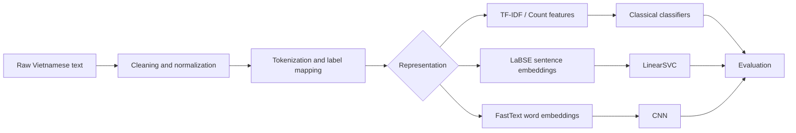
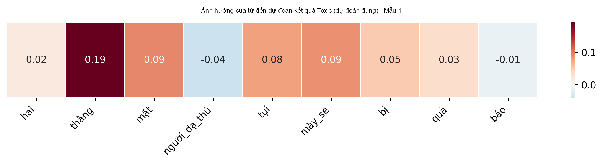
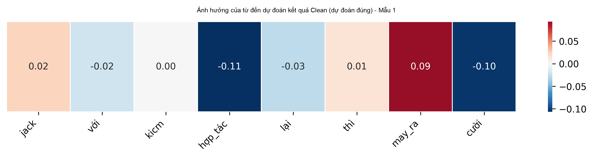
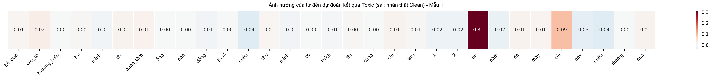
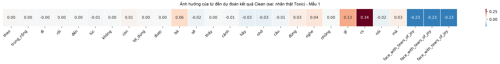

# Vietnamese Hate Speech Detection

## Project Overview

This repository contains a Vietnamese NLP project for text classification, with a focus on detecting harmful, toxic, hate-related, or negative content in Vietnamese text. The project combines dataset analysis, preprocessing, traditional machine learning baselines, sentence-embedding methods, and a deep learning model.

The work is suitable for a university Natural Language Processing final project. It compares simple, interpretable models such as TF-IDF with Logistic Regression against embedding-based and neural approaches such as LaBSE with LinearSVC and CNN with FastText embeddings.

## Datasets

The repository contains analysis scripts and saved analysis outputs for the following Vietnamese datasets:

| Dataset | Task | Labels / Mapping | Available statistics |
| --- | --- | --- | --- |
| ViHSD | Vietnamese social media hate speech detection | Original labels: `0`, `1`, `2`; preprocessing maps `0 -> Clean` and `1, 2 -> Toxic` | 33,400 samples. Label counts: `0`: 27,624, `1`: 2,262, `2`: 3,514 |
| ViCTSD | Vietnamese constructive and toxic speech detection | Toxicity labels include non-toxic and toxic categories. Preprocessing maps `Toxicity 0 -> Clean` and `Toxicity 1 -> Toxic` | 10,000 samples. Toxicity counts: `0`: 8,899, `1`: 1,101 |
| VLSP 2016 | Vietnamese sentiment analysis dataset | Original labels: `NEG`, `NEU`, `POS`; preprocessing maps `NEG -> Toxic/Negative` and `NEU, POS -> Clean/Non-negative` | 6,250 samples. Label counts: `NEG`: 2,089, `NEU`: 2,059, `POS`: 2,102 |

The raw dataset CSV files are not currently committed in this repository. They are expected to be placed locally before running preprocessing or analysis scripts.

Available dataset analysis figures include label distributions, text length distributions, top frequent words, and label co-occurrence plots where applicable.

## Data Preprocessing

The main preprocessing workflow is implemented in `Preprocessing Data/preprocessing_data.py`. The implemented steps include:

- Loading ViHSD, ViCTSD, and review/sentiment CSV files.
- Merging train, dev, valid, and test splits where appropriate.
- Mapping source labels into a binary classification task:
  - `0`: Clean / non-toxic / non-negative.
  - `1`: Toxic / harmful / negative.
- Unicode NFC normalization.
- Lowercasing.
- Removing URLs and hashtags.
- Converting emoji to text with `emoji.demojize`.
- Replacing common text emoticons.
- Removing unsupported special characters while keeping word characters and underscores.
- Reducing repeated characters.
- Expanding teencode/slang terms using `teencode.txt` when available.
- Removing extra whitespace.
- Vietnamese word segmentation with `underthesea.word_tokenize`.
- Removing empty samples after preprocessing.
- Removing duplicate texts.
- Splitting social-media data into train, validation, and test splits.
- Adding review/sentiment data to the training split to improve coverage.

The generated files are:

- `final_train.csv`
- `final_valid.csv`
- `final_test.csv`

These generated files are not currently committed.

## Models

### Logistic Regression + TF-IDF

Implemented in `Code/baseline_lr_tfidf.py`.

This baseline represents Vietnamese text with TF-IDF word n-gram features and trains a balanced Logistic Regression classifier. It is a simple and interpretable baseline for binary toxic speech classification.

### LinearSVC + LaBSE

Implemented in `Code/LaBSE_LinearSVC.PY`.

This model uses `sentence-transformers/LaBSE` to encode each text into a sentence-level semantic embedding. The embeddings are standardized with `StandardScaler`, then classified with a balanced `LinearSVC`.

### CNN + FastText

Implemented in `Code/model_cnn_fasttext.py`.

This model tokenizes text, maps tokens to pretrained FastText Vietnamese word embeddings from `cc.vi.300.vec`, and trains a CNN over the embedding sequence. The CNN uses convolutional layers to learn local n-gram patterns. The result file reports the model with `Threshold=0.67`.

The script also generates LIME-based heatmap explanations for true positives, true negatives, false positives, and false negatives.

### Additional Classical Models

Implemented in `Code/train_additional_models.py`.

This script implements additional lightweight text classifiers without relying on scikit-learn model classes:

- Multinomial Naive Bayes with word count n-grams.
- Multinomial Naive Bayes with character count n-grams.
- Bernoulli Naive Bayes with binary word n-grams.
- Rocchio classifier with TF-IDF word n-grams.
- Passive-Aggressive classifier with hashing features.

## Method Summary

General pipeline:

```text
Raw text -> Preprocessing -> Feature representation / Embedding -> Classifier -> Prediction -> Evaluation
```



## Repository Structure

```text
.
|-- Code/
|   |-- baseline_lr_tfidf.py
|   |-- LaBSE_LinearSVC.PY
|   |-- model_cnn_fasttext.py
|   |-- train_additional_models.py
|   |-- result.txt
|   |-- additional_model_results.txt
|   `-- additional_model_results.csv
|-- Heatmap/
|   |-- TP_Toxic_to_Toxic_*.png
|   |-- TN_Clean_to_Clean_*.png
|   |-- FP_Clean_to_Toxic_*.png
|   `-- FN_Toxic_to_Clean_*.png
|-- Preprocessing Data/
|   |-- preprocessing_data.py
|   |-- process_data.py
|   |-- analyze_final_datasets.py
|   |-- analyze_vihsd_dataset.py
|   |-- analyze_victsd_dataset.py
|   |-- analyze_vlsp2016_dataset.py
|   |-- vihsd_analysis_outputs/
|   |-- victsd_analysis_outputs/
|   `-- vlsp2016_analysis_outputs/
|-- update_heatmap_captions.ps1
|-- .gitignore
`-- README.md
```

Important files:

| File | Purpose |
| --- | --- |
| `Preprocessing Data/preprocessing_data.py` | Builds cleaned binary train, validation, and test CSV files. |
| `Preprocessing Data/analyze_vihsd_dataset.py` | Generates ViHSD statistics and plots. |
| `Preprocessing Data/analyze_victsd_dataset.py` | Generates ViCTSD statistics and plots. |
| `Preprocessing Data/analyze_vlsp2016_dataset.py` | Generates VLSP 2016 statistics and plots. |
| `Preprocessing Data/analyze_final_datasets.py` | Summarizes generated `final_train`, `final_valid`, and `final_test` files. |
| `Preprocessing Data/process_data.py` | Translation utility using MarianMT for a Chinese-to-English toxic comment CSV. |
| `Code/baseline_lr_tfidf.py` | Trains and evaluates Logistic Regression with TF-IDF features. |
| `Code/LaBSE_LinearSVC.PY` | Trains and evaluates LinearSVC on LaBSE embeddings. |
| `Code/model_cnn_fasttext.py` | Trains and evaluates CNN with FastText embeddings and LIME heatmaps. |
| `Code/train_additional_models.py` | Trains additional classical classifiers and saves result summaries. |

## Installation

There is currently no `requirements.txt` file in the repository. Install the main dependencies manually:

```bash
pip install pandas numpy scikit-learn matplotlib seaborn emoji underthesea lime
pip install tensorflow torch transformers sentence-transformers sentencepiece
```

For the CNN + FastText model, download the pretrained Vietnamese FastText vector file `cc.vi.300.vec` and place it in the same working directory used to run `model_cnn_fasttext.py`, usually `Code/`.

For the preprocessing script, place the required raw CSV files and `teencode.txt` in the working directory before running the script.

## How to Run

### 1. Analyze source datasets

Run these commands from the `Preprocessing Data/` directory after placing the raw dataset folders there:

```bash
cd "Preprocessing Data"
python analyze_vihsd_dataset.py
python analyze_victsd_dataset.py
python analyze_vlsp2016_dataset.py
```

Expected local raw dataset folders:

- `ViHSD Dataset/`
- `ViCTSD Dataset/`
- `VLSP 2016 Dataset/`

### 2. Preprocess data

Run from the directory that contains the raw CSV files expected by `preprocessing_data.py`:

```bash
python preprocessing_data.py
```

This creates:

```text
final_train.csv
final_valid.csv
final_test.csv
```

The model scripts expect these generated CSV files in their current working directory. The additional model script specifically expects them inside `Code/`.

### 3. Train and evaluate models

After placing `final_train.csv`, `final_valid.csv`, and `final_test.csv` in `Code/`, run:

```bash
cd Code
python baseline_lr_tfidf.py
python LaBSE_LinearSVC.PY
python model_cnn_fasttext.py
python train_additional_models.py --append-result
```

Notes:

- `LaBSE_LinearSVC.PY` downloads/loads the LaBSE model through `sentence-transformers`.
- `model_cnn_fasttext.py` expects `cc.vi.300.vec` for FastText embeddings.
- `train_additional_models.py --append-result` appends additional model results to `result.txt`.

## Evaluation

The implemented evaluation code reports:

- Accuracy.
- Macro Average F1.
- F1 for Clean class (`0`).
- F1 for Toxic class (`1`).
- Validation-tuned threshold for additional classical models.

The following values are copied from `Code/result.txt` and `Code/additional_model_results.csv`.

| Model | Accuracy | Macro F1 | F1 Clean | F1 Toxic |
| --- | ---: | ---: | ---: | ---: |
| MultinomialNB + Char Count ngram(3,5) | 0.8611 | 0.7552 | 0.9162 | 0.5941 |
| MultinomialNB + Word Count ngram(1,2) | 0.8582 | 0.7547 | 0.9140 | 0.5954 |
| PassiveAggressive + Hashing Word ngram(1,2) | 0.8629 | 0.7544 | 0.9176 | 0.5912 |
| CNN FastText (Threshold=0.67) | 0.8675 | 0.7539 | 0.9211 | 0.5866 |
| Logistic Regression + TF-IDF | 0.8300 | 0.7437 | 0.8925 | 0.5949 |
| Rocchio + TF-IDF Word ngram(1,2) | 0.8224 | 0.7148 | 0.8900 | 0.5396 |
| BernoulliNB + Binary Word ngram(1,2) | 0.8115 | 0.7042 | 0.8824 | 0.5261 |
| LinearSVC + LaBSE | 0.7556 | 0.6706 | 0.8379 | 0.5033 |

These scores should be interpreted as repository-recorded experimental results. Re-running experiments may produce slightly different results depending on data placement, package versions, hardware, random seeds, and whether pretrained embeddings are available.

## Results and Visualizations

### Dataset Analysis Figures

ViHSD class distribution:


ViCTSD toxicity distribution:


VLSP 2016 sentiment label distribution:


Additional plots are available under:

- `Preprocessing Data/vihsd_analysis_outputs/plots/`
- `Preprocessing Data/victsd_analysis_outputs/plots/`
- `Preprocessing Data/vlsp2016_analysis_outputs/plots/`

### LIME Heatmaps

The `Heatmap/` directory contains saved LIME explanation heatmaps for CNN predictions:









## References

1. VLSP 2016 Sentiment Analysis dataset.
2. ViHSD dataset for Vietnamese hate speech detection.
3. ViCTSD dataset for Vietnamese constructive and toxic speech detection.
4. Salton, G., and Buckley, C. (1988). Term-weighting approaches in automatic text retrieval.
5. Pedregosa, F. et al. (2011). Scikit-learn: Machine Learning in Python.
6. Feng, F. et al. (2020). Language-agnostic BERT Sentence Embedding.
7. Bojanowski, P. et al. (2017). Enriching Word Vectors with Subword Information.
8. Kim, Y. (2014). Convolutional Neural Networks for Sentence Classification.

## Ethical Note

Hate speech and toxic speech detection systems should be used carefully. Classification errors can affect moderation decisions, user expression, and fairness across dialects or writing styles. Model predictions should support human review rather than fully replace it, especially in high-impact moderation contexts.

## Author / Course Information

Author: To be updated

Course: Natural Language Processing
